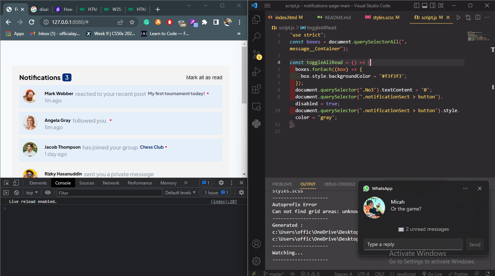
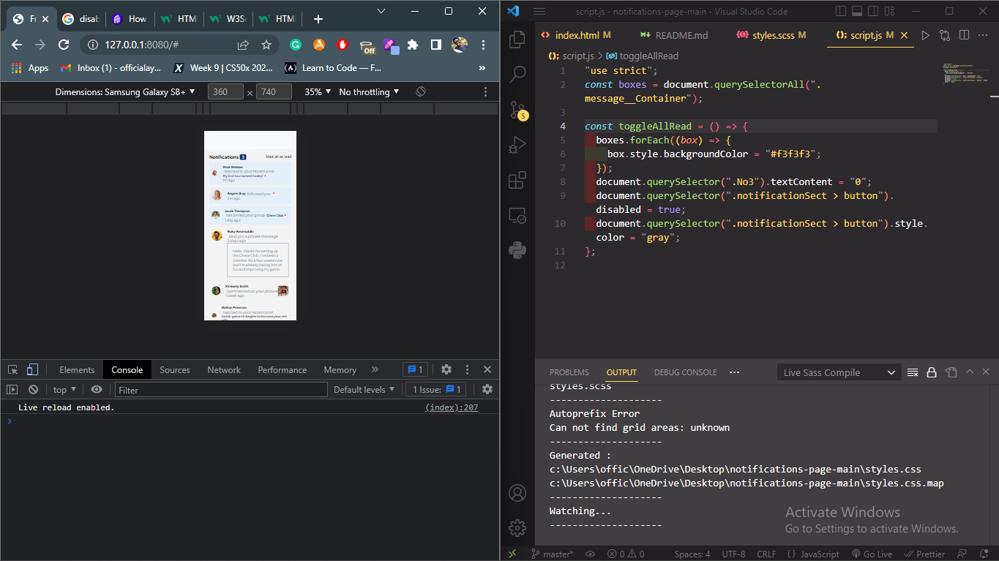

# Frontend Mentor - Notifications page solution

This is a solution to the [Notifications page challenge on Frontend Mentor](https://www.frontendmentor.io/challenges/notifications-page-DqK5QAmKbC). Frontend Mentor challenges help you improve your coding skills by building realistic projects.

## Table of contents

- [Overview](#overview)
  - [The challenge](#the-challenge)
  - [Screenshot](#screenshot)
  - [Links](#links)
- [My process](#my-process)
  - [Built with](#built-with)
  - [What I learned](#what-i-learned)
- [Author](#author)

## Overview

### The challenge

Users should be able to:

- Distinguish between "unread" and "read" notifications
- Select "Mark all as read" to toggle the visual state of the unread notifications and set the number of unread messages to zero
- View the optimal layout for the interface depending on their device's screen size
- See hover and focus states for all interactive elements on the page

### Screenshot




### Links

- Solution URL: [solution URL here](https://your-solution-url.com)
- Live Site URL: [live site URL here](https://notificationspages.netlify.app/)

## My process

### Built with

- Semantic HTML5 markup
- CSS custom properties
- Flexbox
- CSS Grid
- Desktop-first workflow
- SCSS

### What I learned

I discovered how to use SCSS, I beginning to love it. I wished it doesn't require any compiler to make this work. It took me some time to get the compiler to run the code as I wasn't familiar with it yet very well. But now everything comes relatively easy

Some few examples of the codes written with SCSS / Sass syntax are:

```css
.no_Message {
  background-color: #f3f3f3;
  display: grid;
  grid-template-areas:
    "pic content"
    "unknown content2";

  > figcaption {
    grid-area: pic;
  }

  > .message {
    grid-area: content;
  }

  > .messageReceived {
    grid-area: content2;
    margin-left: 20px;
    color: hsl(219, 14%, 63%);
    border: 1px solid hsl(219, 14%, 63%);
    padding: 20px;
    transition: all 0.5s;
  }
}

Normally I'd have to write:

.no_Message {
  background-color: #f3f3f3;
  display: grid;
  grid-template-areas:
    "pic content"
    "unknown content2";
}

  .no_Message > figcaption {
    grid-area: pic;
  }

  .no_Message > .message {
    grid-area: content;
  }

  .no_Message > .messageReceived {
    grid-area: content2;
    margin-left: 20px;
    color: hsl(219, 14%, 63%);
    border: 1px solid hsl(219, 14%, 63%);
    padding: 20px;
    transition: all 0.5s;
  }
```

```js
I also used the disabled property I did learn from one of my previous projects

"use strict";
const boxes = document.querySelectorAll(".message__Container");

const toggleAllRead = () => {
  boxes.forEach((box) => {
    box.style.backgroundColor = "#f3f3f3";
  });
  document.querySelector(".No3").textContent = "0";
  document.querySelector(".notificationSect > button").disabled = true;
  document.querySelector(".notificationSect > button").style.color = "gray";
};
```

## Author

- Website - [Abdullah Ayoola](https://github.com/abdullah43577)
- Frontend Mentor - [@abdullah43577](https://www.frontendmentor.io/profile/abdullah43577)
- Twitter - [@officialayo540](https://twitter.com/officialayo540)
